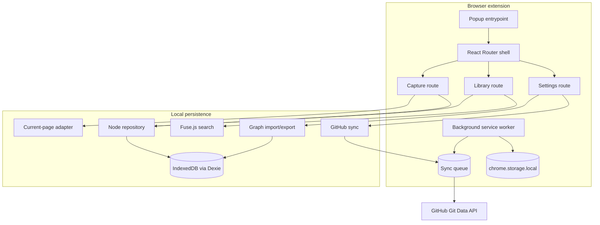

# Architecture overview

KnowlegeGraph is an offline-first Manifest V3 browser extension. Its primary
database is IndexedDB in the user's browser. The popup is a React application,
and a small background service worker handles browser events that must work
while the popup is closed.

## Architectural goals

1. Keep the domain model independent of React, Chrome APIs, and IndexedDB.
2. Keep browser-specific code behind infrastructure modules.
3. Organize user behavior into features rather than technical file types.
4. Make persistence replaceable without rewriting presentation code.
5. Keep the popup fast by doing all MVP work locally.

## Layers

```text
entrypoints
    popup / background
          |
          v
         app
          |
          v
       features
          |
          v
        domain

features ------> infrastructure
features ------> shared
infrastructure -> domain
```

Dependencies should point down this diagram:

- `domain` contains plain TypeScript and depends on no other application layer.
- `infrastructure` implements storage and browser integration using domain
  types.
- `features` compose domain rules, infrastructure services, and feature UI.
- `app` coordinates top-level navigation and live application state.
- `entrypoints` bootstrap the popup or background runtime.
- `shared` contains generic UI and utilities with no feature ownership.

Features must not import another feature's internal component. Shared behavior
should be promoted to `domain`, `infrastructure`, or `shared` based on what it
does.

## Popup runtime



The popup shell owns only:

- the current route;
- the node currently being edited;
- current page capture state;
- the live, recently updated node collection.

Feature-specific form, search, menu, and transfer state remains inside its
feature.

## Background runtime

The background service worker registers the **Save to KnowlegeGraph** context menu.
When invoked, it writes a small `pendingCapture` object to extension local
storage. The popup consumes and removes that object the next time it opens.

This handoff is deliberately separate from the knowledge database:

- browser event handoff is transient and belongs in `chrome.storage.local`;
- durable knowledge belongs in IndexedDB;
- opening the popup does not create a node until the user confirms the form.

## Future extension points

- Relationship editing belongs in a `features/relationships` feature and should
  use the existing domain `Relation` type.
- Markdown generation lives in `infrastructure/markdown`.
- GitHub API access lives in `infrastructure/github`.
- Retry behavior lives in `features/sync` plus the
  `infrastructure/storage` queue table.
- Search indexing can replace the current in-memory Fuse index behind the
  `searchNodes` function without changing Library components.
